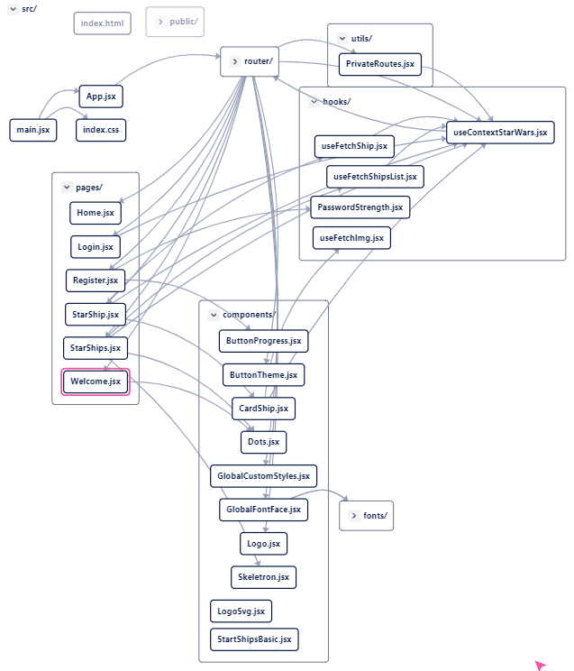
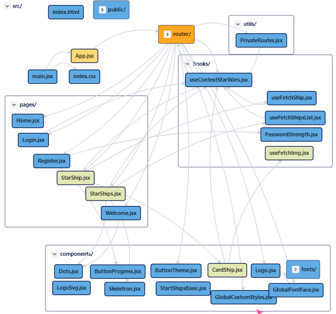
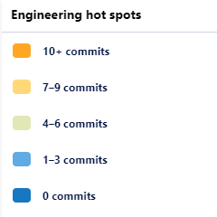

# Star Wars API 

## VIEW PROJECT ONLINE
[👉 here 👁 ](https://star-wars-api-alpha.vercel.app/)
## Tecnologics used
- [Vite](https://vitejs.dev/guide/#scaffolding-your-first-vite-project) for configuration app in react.
- [Mantine](https://mantine.dev/), a component library.
- [CodeSee](https://www.codesee.io/) for genetating a interactive map

Click here to interact with the map 
[👉 Interactive react componet map](https://app.codesee.io/maps/public/5ca04960-f949-11ec-923f-f997deaff59f)



## HotSpots




### Listado de naves

[https://swapi.dev/api/starships/](https://swapi.dev/api/starships/)

### Listado de naves con paginación

[https://swapi.dev/api/starships/?page=1](https://swapi.dev/api/starships/?page=1)


## Usage

This project is bootstrapped with [Vite](https://vitejs.dev/).

### Project setup
```
npm install
```

#### Compiles and hot-reloads for development
```
npm run dev
```

#### Compiles and minifies for production
```
npm run build
```

#### Customize configuration
See [Configuration Reference](https://vitejs.dev/guide/).


### Support notes
We use vite to manage the project configuration.
It allows us to minimize the bundle size and performance issues is really important and overall fast.


# App Usage
- Tab login: It allows you to come into StarShips.
    - Clicking a list item show you a card ship details.
- Tab logout: you logout to welcome page and you won't able to enter StarShips page.
- Tab Register: demo button
StarShips pages: a star ships list. 


### Resources:
[Markdown Cheatsheet](https://github.com/adam-p/markdown-here/wiki/Markdown-Cheatsheet)

[Icons](https://tabler-icons-react.vercel.app/)

[Converting Object to an Array](https://www.samanthaming.com/tidbits/76-converting-object-to-array/)